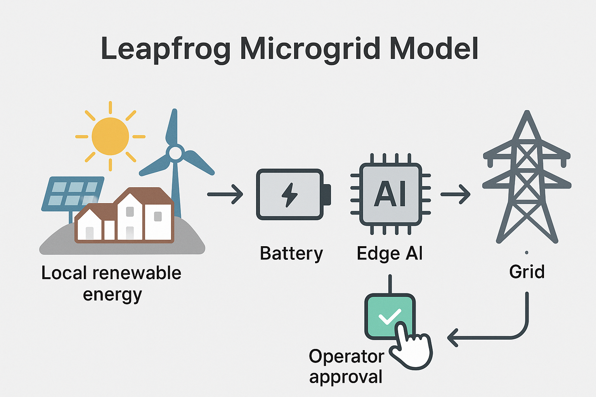

## **AI Consumes Electricity, but Also Designs the Grid**

***The Duality of AI and Energy Through the Lens of the IEA Report and an Execution Framework***

## **(1) Introduction – Why I Read This Report to the End**

When I read technical reports, I often pay more attention to the "structure" than to individual "sentences." The IEA's "Energy and AI" report was no exception. AI appears as a power-consuming entity, but also as a tool for optimizing the grid. A dual role. 

To me, this was not just a technical issue but a sign that **the system itself demands both collision and redesign**.

This article aims to:

1. Structurally summarize the core content of the report, and  
2. Lay out a step-by-step framework to translate it into an executable system.

## **(2) Key Summary of the Report – The Structure of Conflict and Coexistence Between AI and Energy**

### **1. AI Cannot Exist Without Electricity → Data Centers Consume Power at Industrial Scale**

- **As of 2024: Data centers consume 415 TWh (1.5% of global total)**  
- **By 2030: Expected to rise to 945 TWh** → Equivalent to Japan's total electricity usage  
- **AI-specific data centers consume more power than aluminum smelters**  
- Example: GPT-4 training requires **tens of thousands of NVIDIA A100/H100s running 24/7 for weeks** → **Several MW to tens of MW load**, equivalent to consumption by over 100,000 households

### **2. Structure of Power Consumption: Training + Inference + Cooling**

| Stage | Process | Reason for Energy Use |
|-------|---------|------------------------|
| **Training** | Optimize billions of parameters (loss minimization loop) | Repeated large matrix multiplications, parallel GPU operation |
| **Inference** | Generate output from input | Token processing, load accumulates with continuous input |
| **Cooling** | Fans/coolant/insulating oil to prevent server overheating | Accounts for 30~40% of energy use (need for PUE improvement) |

- Cooling evolution: Air → Water → **Immersion Cooling**  
  - With immersion cooling, **PUE < 1.1** is possible (used by Meta, Microsoft)

### **3. Big Tech Doesn’t Rely on National Power Grids – Building Proprietary Energy Systems**

| Company | Energy Strategy |
|---------|-----------------|
| **Google** | Operates solar + wind plants + ESS + 24/7 Carbon-Free Energy project |
| **Microsoft** | Invests in Small Modular Reactors (SMRs), partners with TerraPower |
| **AWS** | Global wind contracts via PPA + operates own wind farms in some regions |
| **Meta** | Installs dedicated solar near data centers + immersion cooling systems |

Key goals: **Energy independence + ESG (carbon neutrality) + supply chain risk mitigation**

### **4. AI Strengthens the Grid: 175 GW Capacity Without Additional Infrastructure**

- With AI-based grid control:
  - **Real-time renewable forecasting** → reduces surplus power
  - **Load shifting optimization** → relieves congestion
  - **Dynamic Line Rating** → adjusts transmission based on weather/wind conditions

Example: U.S. operator TenneT → AI-based load shifting **eased 15% congestion**. AI enables **smarter use of existing infrastructure** without new physical builds

### **5. AI Accelerates Energy Technology Innovation 10x**

| Tech Area | AI Use |
|-----------|--------|
| **CO₂ capture materials (MOFs, Zeolites)** | Predicts high-performance adsorbents using GNN, XGBoost |
| **Batteries** | Predicts chemistry combinations, optimizes charging/discharging pathways |
| **Synthetic fuel catalysts** | Analyzes papers + patents with LLMs to identify promising candidates |
| **Cement/Steel CO₂ reduction** | Models processes + optimizes control via reinforcement learning |

MIT: RL-based CO₂ process control → **20% energy savings**

### **6. AI Emits Carbon Too → Balance Is Needed**

- Report scenarios (Base Case):
  - Data center emissions: **180 Mt in 2024 → 300 Mt by 2035**
  - Worst-case (Lift-Off): **could rise to 500 Mt**

- Meanwhile, AI-driven optimization may reduce **5~7% of total energy emissions**

▶ **AI reduces GHGs but is also a significant emitter – a duality exists**

### **7. Explainable AI Is Essential in the Energy Sector**

- In grid control, CO₂ processes, and policy decisions:
  - Must **explain the rationale** behind decisions
  - Must present prediction + reasoning via **numbers/logics/visuals** for regulatory clarity

| Predictive Models | Explainable Models |
|------------------|---------------------|
| GPT, DNN, CNN | XGBoost + SHAP, Autoencoders, Rule-based |
| High performance but black-box | Slightly lower performance but more trustworthy |

### **8. Emerging Markets Have High Leapfrog Potential in AI+Energy**

- Many internet users, but limited data center infrastructure → **leap opportunities**
- Requirements: **Grid stability + renewable spread + digital talent pool**
- With AI: **Short-term scale-up of forecasting, efficient plant ops, local energy optimization**

Examples: India, Indonesia, Kenya → expanding AI-based microgrids, digital ESS

**Summary: AI is Both a Heavy Energy Consumer and the Strongest Catalyst for Energy Innovation.**
**The key to future energy strategy lies in who controls and utilizes this duality.**

---

## **(3) Execution Framework – Turning This Flow into a Structured System**

### **1. Define Preconditions – What Needs to Be in Place?**

The report outlines an inspiring flow, but actual implementation requires more than a vision — it demands clear conditions across **technology**, **infrastructure**, and **institutions**.

#### ① Technological Preconditions: AI Must Be Interpretable and Controllable  
AI must move beyond simple prediction to **explainable control**. Especially in grid operations, carbon capture, and automated data centers, operators need to understand **why** AI made a decision.

Examples:  
- LSTM + SHAP explanations  
- GNN with feature attribution  
- Rule-based corrective logic  

Accuracy alone is no longer enough — **trust and explainability** take precedence.

#### ② Infrastructure Preconditions: AI Must Be Sensor-Connected and Bidirectional  
AI cannot function without real-time data. Sensor-based infrastructure is essential.

Use cases:  
- Grid systems: sensing temperature, load, wind, and solar radiation  
- Facility management: vibration, heat, leak detection sensors  

AI must not be a **passive calculator** but an **active controller** in a **digital twin** framework.  
AI is the "brain", but sensors and actuators are the "nervous system" — they must come first.

#### ③ Institutional Preconditions: AI Must Be a Co-Pilot, Not a Commander  
Public and safety concerns prevent full AI autonomy in energy systems. Therefore, AI should make **interpretable suggestions**, with final decisions approved by human operators or policymakers.

Institutional conditions:  
- Transparent, explainable reports  
- Manual override protocols for anomaly detection  
- Clear operator-AI interface standards  

**Executable AI must be designed as a “reviewable assistant,” not an omnipotent engine.**

---

### **2. Assess Executability – Where and How to Start?**

Even with sound theory, execution depends on context. We must evaluate **priority areas**, **practical bottlenecks**, and **geographic feasibility** to avoid turning a strategy into wishful thinking.

#### ① Deployment Priorities: Not All Systems Are Ready

We prioritize areas with high demand, clear structure, and human interpretability.

| Priority | Area                   | Reason                                                                 |
|----------|------------------------|------------------------------------------------------------------------|
| 1st      | Renewable forecasting  | Strong demand, clear prediction structure, direct link to decisions    |
| 2nd      | Grid load shifting     | Sensor-based, semi-controllable, integrable with current systems       |
| 3rd      | CO₂ capture control    | Technically complex, high cost, sensitive to regulation                |

▶ Adoption depends more on **operational trust** than technical feasibility.

#### ② Bottlenecks: People and Policy More Than Tech

| Bottleneck           | Description                                                                 |
|----------------------|-----------------------------------------------------------------------------|
| **Unexplainable AI** | Black-box models fail to provide rationale → operator rejection             |
| **Data access**       | Lack of high-resolution, real-time sensing and poor inter-system connectivity |
| **Policy rigidity**   | No protocols to validate/approve AI recommendations                         |

▶ The tech exists — but institutions and people are not fully prepared.

#### ③ Geography Matters: Malaysia Leapfrogs, Korea Integrates

| Region                 | Approach                                               | Rationale                                         |
|------------------------|--------------------------------------------------------|--------------------------------------------------|
| Malaysia / Emerging    | AI-led microgrids + dashboard for operators            | Flexible regulation allows bottom-up design      |
| Korea / Advanced       | Integrated AI into legacy systems                      | Assistive control within rigid legacy structure  |
| Big Tech               | Full-stack AI optimization of private energy systems   | Own infrastructure and full data sovereignty     |

▶ Execution hinges less on national identity and more on **infrastructure control and data access**.

---

### **3. System Structuring – What Would an Actual Implementation Look Like?**

The abstract “role of AI” must be translated into a connected system that links **prediction**, **judgment**, **execution**, and **feedback** in a continuous loop.

### Example 1: AI Grid Optimization Loop (For Fixed Infrastructure)

| Step | Description |
|------|-------------|
| **1. Real-time sensing** | Environment data: wind, temperature, load, power flow |
| **2. AI forecasting** | - LSTM for renewable energy prediction - GNN for power congestion forecasting |
| **3. AI judgment** | - Load shifting decisions - ESS (Energy Storage System) dispatching - SHAP-based model explanation |
| **4. Operator review** | Dashboard interface for approval or manual intervention |
| **5. Execution & feedback** | Action execution with data returned to retrain models |

**Design priority**: Maintain the full loop without breaks  
**Interpretability** is key for operator trust and sustainable adoption.

### Example 2: Leapfrog Microgrid Model (e.g., Malaysia)

| Step | Description |
|------|-------------|
| **1. Local energy setup** | Deploy local renewables (solar, wind) and battery storage |
| **2. Edge AI forecasting** | Use lightweight models (e.g., XGBoost) for real-time demand prediction |
| **3. Autonomous scheduling** | Optimize energy use with explainable AI decision logic |
| **4. Operator approval** | One-click dashboard confirmation or rule-based automation |
| **5. Grid integration** | Connect to national grid or enable peer-to-peer (P2P) energy sharing |

In infrastructure-limited regions, combine local optimization with explainable AI to reduce regulatory friction and accelerate adoption.

### **Design Principles – 3 Rules for Systemization**

1. **Design "explanation" before prediction** — transparency is more important than accuracy.  
2. **AI should assist, not dominate** — assign AI the role of a co-pilot.  
3. **Establish a closed loop** — Predict → Judge → Execute → Feedback → Retrain.

---

## **(4) Conclusion – How Should We Understand the Clash Between AI and Energy?**

This report is not merely about technological progress. It reveals how **AI and energy collide and cooperate at the same time**, and why this tension demands a new kind of system design.

AI is a **dual entity** — it consumes electricity and optimizes it. This duality is not just a technical challenge, but a structural one. Only through deliberate and thoughtful **system design** can we transition toward a sustainable energy future.

Therefore, our goal should not be limited to deploying AI technologies. We must go further — to **design executable, structured systems** that make integration real.

For AI to be truly embedded into the power grid, the system must be built with:  
- **Explainability**,  
- **Institutional trust**, and  
- **Feedback loops** at its core.

The clash between AI and energy is a symptom of **poorly designed systems**. Our task now is not just to observe that conflict — but to resolve it through the creation of **new, integrated architectures**.

